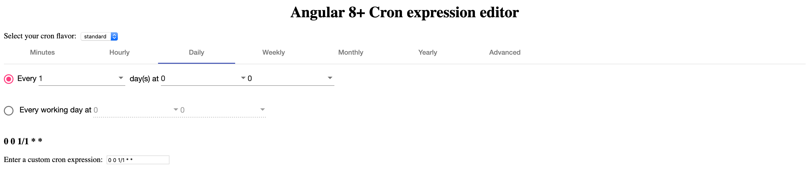

Angular Material Design Cron Editor
===

A library that helps the user graphically build a CRON expression using Angular 8+. 

This library has a long history. It is a fork of the  vincentjames501's [angular-cron-gen](https://github.com/vincentjames501/angular-cron-gen) 
for AngularJS 1.5+ and claudiuconstantin's [cron-editor(https://github.com/claudiuconstantin/cron-editor)] to create an Angular 8+, Material design
editor.



To run the sample app just run `npm run start` and go to `http://localhost:4444/`. The app will automatically reload if you change any of the source files.

This library is published to NPM and Github as: `@zapinfo/ngx-cron-editor`

## Demo

A work-in-progress demo can be found [here](https://esarmientoe.github.io/cron-editor/)

## Usage

1. Install the npm package:
    ```
    $ npm i @zapinfo/ngx-cron-editor -S
    ```

2. Import the module in your own module:

    ```ts
    import { CronEditorModule } from '@zapinfo/ngx-cron-editor';

    @NgModule({
        imports: [..., CronEditorModule],
    ...
    })
    export class MyModule {
    }
    ```

3. Use the component in your html code:

    ```html
    <cron-editor [(cron)]="cronExpression"></cron-editor>
    ```

4. That's it, you're done!

## Options

```html
<cron-editor [(cron)]="cronExpression" [options]="cronOptions"></cron-editor>
```

```ts
import { CronOptions } from "@zapinfo/ngx-cron-editor";

@Component({
    ...
})
export class MyComponent {
   public cronOptions: CronOptions = {
       formInputClass: 'form-control cron-editor-input',
       formSelectClass: 'form-control cron-editor-select',
       formRadioClass: 'cron-editor-radio',
       formCheckboxClass: 'cron-editor-checkbox',
       
       defaultTime: "00:00:00",

       hideMinutesTab: false,
       hideHourlyTab: false,
       hideDailyTab: false,
       hideWeeklyTab: false,
       hideMonthlyTab: false,
       hideYearlyTab: false,
       hideAdvancedTab: true,
       hideSpecificWeekDayTab : false,
       hideSpecificMonthWeekTab : false,

       use24HourTime: true,
       hideSeconds: false,

       cronFlavor: CronFlavor.quartz
    };
}
```

## ZAPinfo Developer Notes

Internally, we use github for package management.

To pubish, [first login](https://help.github.com/en/articles/configuring-npm-for-use-with-github-package-registry#authenticating-to-github-package-registry) (requires personal access token):

```
npm login --registry=https://npm.pkg.github.com/
```

Then publish the package:

```
npm publish
```

## License:

Licensed under the MIT license
